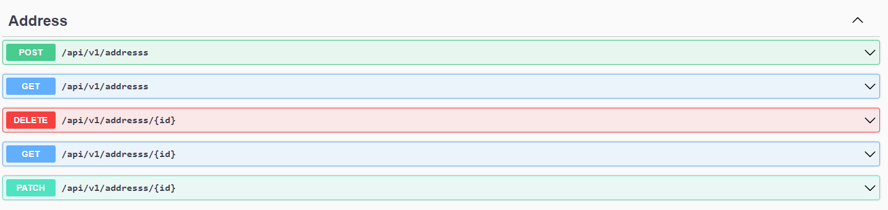
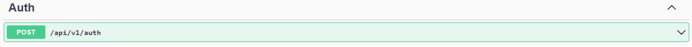
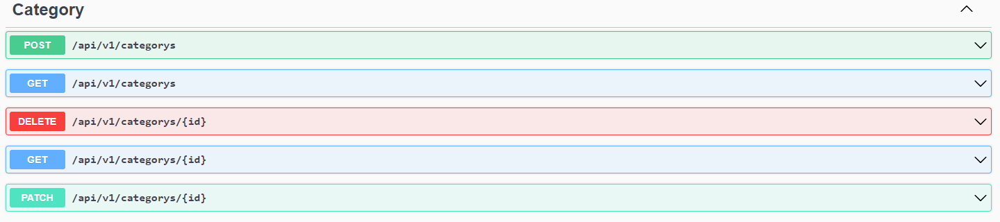
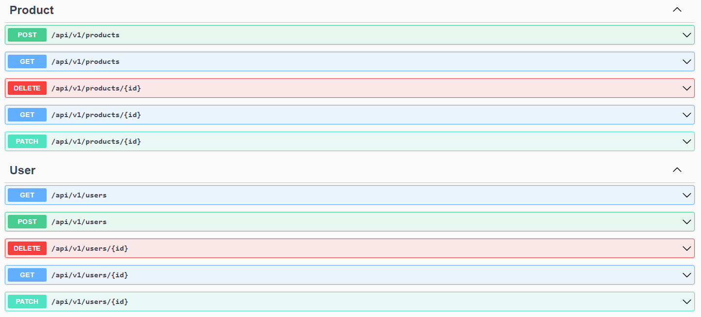
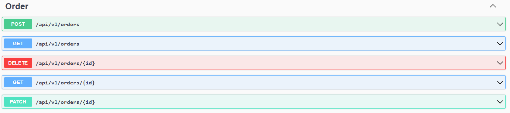

# Fullstack Project

This project involves creating a Fullstack project with React and Redux in the frontend and ASP.NET Core 7 in the backend. The goal is to provide a seamless experience for users, along with robust management system for administrators.

- Frontend: SASS, TypeScript, React, Redux Toolkit
- Backend: ASP.NET Core, Entity Framework Core, PostgreSQL

You can follow the same topics as your backend project or choose the alternative one, between E-commerce and Library. You can reuse the previous frontend project, with necessary modification to fit your backend server.

## Table of Contents

1. [Instruction](#instruction)
2. [Features](#features)
   - [Mandatory features](#mandatory-features)
   - [Extra features](#extra-features)
3. [Requirements](#requirements)
4. [Getting Started](#getting-started)
5. [Testing](#testing)

## Instruction

This repository is used only for backend server. The frontend server is done in a separate repository [here](https://github.com/MattiHel85/fs16_6-frontend-project). I modified the front end both in logic and in styling so I have two separately deployed projects both using similar APIs (mine and the Platzi Fake Store API mentioned below)

### Frontend
The front end is deployed [here](https://fakestoreinc.netlify.app) from the GitHub repository found [here](https://github.com/MattiHel85/fs16_6-frontend-project)

It is a modified version of the previous front end project which originally used the [Platzi Fake Store API](https://fakeapi.platzi.com/) but is now using the API I created using ASP.NET Core, Entity Framework Core, and PostgreSQL.

### Backend

The backend was created using SP.NET Core, Entity Framework Core, and PostgreSQL and is hosted in Azure and requests can be sent to the following end points

## AUTH
GET, POST https://fakestoreinc.azurewebsites.net/api/v1/auth

## USERS
GET, POST https://fakestoreinc.azurewebsites.net/api/v1/users
GET, PATCH, DELETE https://fakestoreinc.azurewebsites.net/api/v1/users/:id

## PRODUCTS
GET, POST https://fakestoreinc.azurewebsites.net/api/v1/products/
GET, PATCH, DELETE https://fakestoreinc.azurewebsites.net/api/v1/products/:id

## CATEGORIES
GET, POST https://fakestoreinc.azurewebsites.net/api/v1/categorys/
GET, PATCH, DELETE https://fakestoreinc.azurewebsites.net/api/v1/categorys/:id

## ORDERS
GET, POST https://fakestoreinc.azurewebsites.net/api/v1/orders
GET, PATCH, DELETE https://fakestoreinc.azurewebsites.net/api/v1/orders/:id

## Features

#### User Functionalities

1. User Management: Users can register for an user account and log in. Users cannot register themselves as admin.
2. Browse Products: Users can view all available products and single product, search and sort products.
3. Add to Cart: Users can add products to a shopping cart, and manage cart.
4. Checkout: Users will be able to place orders in the future.

#### Admin Functionalities

1. User Management: Admins can view and delete users.
2. Product Management: Admins can view, edit, delete and add new products.
2. Category Management: Admins can view, edit, delete and add new categories.
3. Order Management: Admins will be able to view all orders.

### Extra features

#### User Functionalities

1. User Management: Users can view and edit only certain properties in their accounts. They also can unregister their own accounts.
2. Authentication and account registration with JWT tokens (Google Oauth to come later).
3. Order Management: Users will be able to view their order history, track the status of their orders, and potentially cancel orders within a certain timeframe.

#### Admin Functionalities

1. User Management: Admins are able to edit users' role and create new users and admins.
2. Order Management: Admins will able to update order status, view order details, and cancel orders.

# Completed Project Summary

## Requirements Fulfilled:

### 1. CLEAN Architecture Implementation:

- Applied CLEAN architecture in the backend.

### 2. Error Handling:

- Implemented an error handler to manage exceptions within the application.
- Ensured appropriate handling and returned helpful error messages.

### 3. Unit Testing:

- This has not been implemented yet, but is coming in the near future

### 4. Swagger Documentation:

- Annotated API endpoints for comprehensive documentation.
- Generated Swagger UI for simplified testing and documentation.

### 5. File Structure and Naming Conventions:

- Established a proper file structure and adhered to consistent naming conventions.
- Ensured compliance with Rest API standards.

